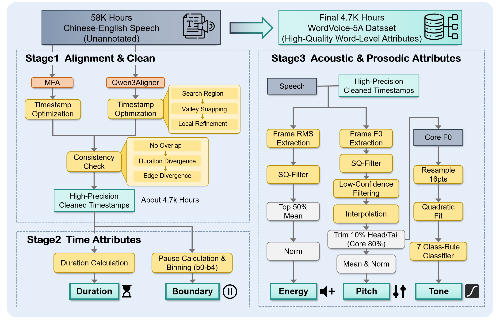

# WordVoice Data Pipeline 🚀

<div align="center">

<br>

[](#)
[](https://xxh333.github.io/wordvoice-demo/)
[](https://huggingface.co/datasets/XXH333/WordVoice-5A)
[](https://huggingface.co/XXH333/WordVoice-base-0.5B)
[](https://www.python.org/)
[](LICENSE)

**Official linguistically-guided word-level annotation pipeline for the WordVoice-5A dataset**



</div>

---

<div align="center">

# 🌏 Language

**🇨🇳 中文 | EN English**

[跳转到中文](#-中文说明) ｜ [Jump to English](#en-english-demonstration)

</div>

---

# 🇨🇳 中文说明

## 概述

**WordVoice Data Pipeline** 是 **WordVoice** 数据集官方发布的词级声学标注流水线，用于自动构建**大规模、高质量、词级声学数据集**，服务于可控 LLM Text-to-Speech（TTS）研究。

不同于传统 Forced Alignment 仅提供时间戳，本项目融合了：

- 双模型词对齐（Dual-model Alignment）
- 边界优化（Boundary Refinement）
- 多维韵律标注（Prosodic Annotation）

能够自动生成 **WordVoice-5A** 等高质量词级数据集。

目前支持：

- ✅ 中文（Mandarin Chinese，`zh`）
- ✅ 英文（English，`en`）

---

# ✨ 功能特点

## 🎯 高精度词级对齐

采用双模型联合对齐：

- Montreal Forced Aligner (MFA)
- Qwen3FA

并进一步实现：

- 双模型一致性检测
- 自动过滤低置信度结果
- 提升词边界准确率

---

## 🔍 边界优化

基于响度信息进一步优化词边界：

- 去除多余静音
- 修正协同发音（Coarticulation）
- 获得更加自然的词级切分

---

## 📊 五维声学标注

每个词均生成以下五类标注：

| 属性 | 描述 |
|------|------|
| ⏱ Duration | 词持续时间 |
| ⏸ Boundary | 五级停顿类别（b0–b4） |
| 🔊 Energy | 截断归一化后的音节核心能量 |
| 🎵 Pitch | 双侧截断后的核心 F0 |
| 📈 Tone | 基于16点多项式拟合得到的七类韵律形态 |

---

## 🌍 支持语言

| Language | Status |
|-----------|--------|
| Mandarin Chinese | ✅ |
| English | ✅ |

未来将支持更多语言。

---

# 安装

由于 **Montreal Forced Aligner (MFA)** 依赖 Kaldi 与多个 C++ 库，推荐使用 Conda 安装。

## Step 1. 创建环境

```bash
conda create -n wordvoice-5a -c conda-forge python=3.10 montreal-forced-aligner=3.3.8
conda activate wordvoice-5a


```

## Step 2. 克隆仓库

```bash
git clone https://github.com/XXH333/WordVoice-5A-Pipeline.git

cd WordVoice-5A-Pipeline
```

## Step 3. 安装依赖

更新 mfa 相关库:
```bash
conda install -c conda-forge -y \
  kalpy=0.8.2 \
  kaldi=5.5.1172=cuda129hd86434a_3 \
  libopenblas=0.3.30=pthreads_h94d23a6_4 \
  libblas=3.11.0=5_h4a7cf45_openblas \
  libcblas=3.11.0=5_h0358290_openblas \
  liblapack=3.11.0=5_h47877c9_openblas \
  liblapacke=3.11.0=5_h6ae95b6_openblas
```
若 mfa 相关的库下载失败，我们在 `data.sh` 里也提供了单模型的时间戳对齐方法。

安装其他依赖:
```bash
pip install -e .

pip install qwen-asr
```


---

# 下载模型

执行：

```bash
bash download_models.sh
```

脚本将自动下载所有模型及相关资源。

---

# 运行 Pipeline

完整示例位于：

```text
test_demo/
```

目录结构：

```text
test_demo/
├── audio_files/
└── json_files/
```

直接运行：

```bash
bash data.sh
```

---

# 引用

如果本项目对你的研究有所帮助，请引用：

```bibtex
@article{wordvoice2026,
  title={WordVoice: Linguistically-Guided Word-Level Acoustic Dataset for Controllable LLM-based Text-to-Speech},
  author={Anonymous},
  journal={arXiv},
  year={2027}
}
```

---

# License

本项目采用 MIT License。

详见：

```
LICENSE
```

---

# 致谢

本项目基于以下优秀开源项目：

- Montreal Forced Aligner (MFA)
- Qwen3FA

感谢所有作者和贡献者。

---

# 联系我们

如有问题、Bug 或合作需求，请提交 Issue 或 Pull Request。

---

<div align="right">

[⬆ 返回顶部](#wordvoice-data-pipeline-)

</div>

---

# EN English Demonstration

## Overview

**WordVoice Data Pipeline** is the official annotation toolkit for constructing **large-scale, high-quality, word-level acoustic datasets** for controllable LLM-based Text-to-Speech (TTS).

Unlike conventional forced-alignment pipelines that only provide timestamps, our framework integrates:

- Dual-model alignment
- Boundary refinement
- Multi-dimensional prosodic annotation

to automatically construct datasets such as **WordVoice-5A**.

The pipeline currently supports:

- ✅ Mandarin Chinese (`zh`)
- ✅ English (`en`)

---

# ✨ Features

## 🎯 Accurate Word Alignment

Dual-model alignment using:

- Montreal Forced Aligner (MFA)
- Qwen3FA

Additional mechanisms include:

- Automatic consistency checking
- Confidence filtering
- Improved word boundary accuracy

---

## 🔍 Boundary Refinement

Boundary optimization based on loudness analysis:

- Remove excessive silence
- Mitigate coarticulation bleeding
- Produce more natural acoustic segments

---

## 📊 Five-Dimensional Acoustic Annotation

Each word is annotated with:

| Feature | Description |
|----------|-------------|
| ⏱ Duration | Word-level duration |
| ⏸ Boundary | Five-level pause category (`b0`–`b4`) |
| 🔊 Energy | Truncated & normalized syllable nucleus energy |
| 🎵 Pitch | Core F0 extraction with bilateral truncation |
| 📈 Tone | Seven-category prosodic morphology via 16-point polynomial regression |

---

## 🌍 Supported Languages

| Language | Status |
|-----------|--------|
| Mandarin Chinese | ✅ |
| English | ✅ |

More languages will be supported in future releases.

---

# Installation

Because **Montreal Forced Aligner (MFA)** depends on Kaldi and several C++ libraries, we strongly recommend installing it with Conda.

## Step 1. Create Environment

```bash
conda create -n wordvoice-5a -c conda-forge python=3.10 montreal-forced-aligner=3.3.8
conda activate wordvoice-5a
```

## Step 2. Clone Repository

```bash
git clone https://github.com/XXH333/WordVoice-5A-Pipeline.git

cd WordVoice-5A-Pipeline
```

## Step 3. Install Dependencies

Update MFA-related packages:
```bash
conda install -c conda-forge -y \
  kalpy=0.8.2 \
  kaldi=5.5.1172=cuda129hd86434a_3 \
  libopenblas=0.3.30=pthreads_h94d23a6_4 \
  libblas=3.11.0=5_h4a7cf45_openblas \
  libcblas=3.11.0=5_h0358290_openblas \
  liblapack=3.11.0=5_h47877c9_openblas \
  liblapacke=3.11.0=5_h6ae95b6_openblas
```
If the MFA-related packages fail to install, we also provide a single-model timestamp alignment method in `data.sh`

Install additional dependencies:
```bash
pip install -e .

pip install qwen-asr
```

---

# Download Models

Run

```bash
bash download_models.sh
```

to automatically download all required models and resources.

---

# Run the Pipeline

A complete example is provided in

```text
test_demo/
```

Directory structure:

```text
test_demo/
├── audio_files/
└── json_files/
```

Run:

```bash
bash data.sh
```

---

# Citation

If you use this project or the **WordVoice** dataset, please cite:

```bibtex
@article{wordvoice2026,
  title={WordVoice: Linguistically-Guided Word-Level Acoustic Dataset for Controllable LLM-based Text-to-Speech},
  author={Anonymous},
  journal={arXiv},
  year={2027}
}
```

---

# License

Released under the MIT License.

See `LICENSE` for details.

---

# Acknowledgements

This project builds upon several outstanding open-source projects:

- Montreal Forced Aligner (MFA)
- Qwen3FA

We sincerely thank all authors and contributors.

---

# Contact

For questions, bug reports, or collaboration opportunities, please open an Issue or submit a Pull Request.

---

<div align="center">

**WordVoice Data Pipeline**

Building high-quality word-level acoustic annotations for controllable speech generation.

</div>

<div align="right">

[⬆ Back to Top](#wordvoice-data-pipeline-)

</div>
